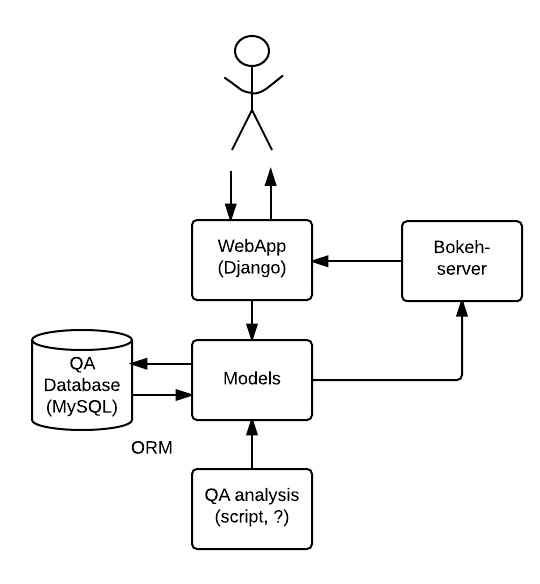
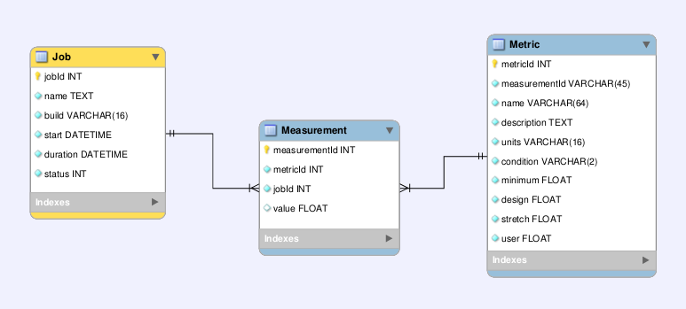
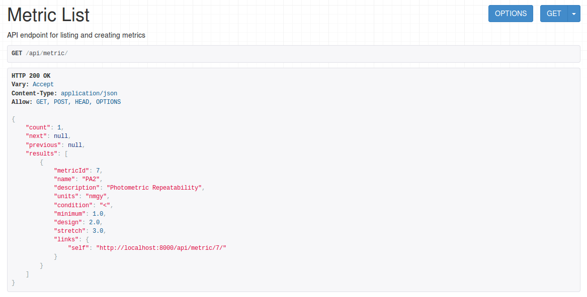

..
  Content of technical report.

  See http://docs.lsst.codes/en/latest/development/docs/rst_styleguide.html
  for a guide to reStructuredText writing.

  Do not put the title, authors or other metadata in this document;
  those are automatically added.

  Use the following syntax for sections:

  Sections
  ========

  and

  Subsections
  -----------

  and

  Subsubsections
  ^^^^^^^^^^^^^^

  To add images, add the image file (png, svg or jpeg preferred) to the
  _static/ directory. The reST syntax for adding the image is

  .. figure:: /_static/filename.ext
     :name: fig-label
     :target: http://target.link/url

     Caption text.

   Run: ``make html`` and ``open _build/html/index.html`` to preview your work.
   See the README at https://github.com/lsst-sqre/lsst-report-bootstrap or
   this repo's README for more info.

   Feel free to delete this instructional comment.

:tocdepth: 1

.. note::
    Work in progress. This document is the design for the QA dashboard and it is being used by SQuaRE developers during the X16 cycle.

Introduction
============

This document describes the implementation of a prototype dashboard for the
Science Quality Analysis Harness (SQUASH) system.

As stated in http://sqr-008.lsst.io the verification datasets use case
gives us the opportunity to leverage QA tests done in the past with pipeQA and more recently with HSC and CFHT QA
scripts in a comprehensive infrastructure preserving "QA analysis code" and practices developed
by the verification datasets group.

For **level 0 QA**, the prototype will test the stability of the LSST code against the science requirements for single
image processing (LPM-17) also known as *key performance metrics* (KPMs) as part of the continuous integration (CI) system.

The development will follow the rapid prototype workflow to reach this goal more
efficiently. The goal for X16 is to have minimal viable product (MVP) in production.
This way we get early feedback from users and iterate back to make improvements.

The main goal is to anticipate SQUASH needs for commissioning, and leverage
the production SDQA system based on the experience of testing the LSST stack on precursor
datasets.

Selecting the right technology stack
====================================

The selected technologies prioritize the use of Python as the 
main development language, and a mature framework like Django to facilitate development.

The dashboard uses the bokeh plotting library and datashader to
create interactive visualizations.

For level 0 QA, the QA analysis code is developed as *afterburner* scripts that
runs on the output of the LSST stack processing (http://dmtn-008.lsst.io/en/latest/)
These scripts will be executed as jenkins jobs as part of the CI runs an will push data to the QA dashboard
for monitoring.

For level 1 and 2 QA, FITS image visualization will be added using FFTools JS API linked from the dashboard.
For all-sky visualization we plan to integrate Aladin Lite and HiPS images (http://aladin.u-strasbg.fr/hips/)

The visualization needs, as summarized at https://dev.lsstcorp.org/trac/wiki/Winter2014/Design/DataAnalysisToolkit
have been taken into consideration.

Architecture
============

The architecture of the SQUASH dashboard is shown in figure 1.
The QA database is modeled based on the LSST baseline database schema and adapted to this
prototype. It is implemented using the object-relational mapper (ORM) built in the Django framework.
The QA analysis code sends data to the dashboard through a ``POST`` request and a ``post_save`` signal
from Django is used to automatically update the bokeh sessions (i.e plots and information in the dashboard).

   Main components of SQUASH dashboard prototype.

Implementation Roadmap
======================

SQUASH MVP Epic for X16 (https://jira.lsstcorp.org/browse/DM-5555)

Phase 1: Initial Django project and integration with bokeh server
^^^^^^^^^^^^^^^^^^^^^^^^^^^^^^^^^^^^^^^^^^^^^^^^^^^^^^^^^^^^^^^^^

    - DM-5728 Create Django project and initial dashboard app  (See Appendix A)
        - Implement the ``Job``, ``Metric`` and ``Measurement`` models as a minimum set of tables for the dashboard app
        - Prototype home page and dashboard pages
    - DM-5750 Integration of Django with bokeh server

Phase 2: Integration with QA analysis code
^^^^^^^^^^^^^^^^^^^^^^^^^^^^^^^^^^^^^^^^^^

    - DM-5745 implement ingestion code for the QA results
        - Implement API endpoints for Jobs and Metrics

    - DM-6086 JSON Schema for metric data from validate_drp to be ingested by the QA Dashboard app

Phase 3: Implement software provenance in the dashboard
^^^^^^^^^^^^^^^^^^^^^^^^^^^^^^^^^^^^^^^^^^^^^^^^^^^^^^^^

    - DM-5943 Add Git refs to Jobs Table of QA Dashboard
       - Implement the ``VersionedPackage`` model

Phase 4: Adding more interactions to the dashboard
^^^^^^^^^^^^^^^^^^^^^^^^^^^^^^^^^^^^^^^^^^^^^^^^^^

    - Ability to link dashboard to the CI runs
    - Ability to display KPM vs. git commits
    - Ability to navigate through the list of Metrics

SQUASH Epic for F16

Phase 5: Adding support to multiple datasets
^^^^^^^^^^^^^^^^^^^^^^^^^^^^^^^^^^^^^^^^^^^^

    - Add datasets table in the Django ORM layer
    - Ability to access dataset information
    - Ability to display and select available runs for each dataset

Cloning the project
====================

.. code-block:: text

    $ git clone  https://github.com/lsst-sqre/qa-dashboard.git

See the README file for instructions.

Level 0 QA
==========

For level 0 QA, the data model includes the ``Job``, ``Measurement``, ``Metric`` and ``VersionedPackage`` tables which are sufficient to
characterize a metric and its measurement by the CI job and keep track of the version of the LSST stack code.

.. note::

   Missing ``VersionedPackage`` table and schema updates.

   Level 0 database schema.

The metrics table is initialized with the values specified in the science requirements document LPM-17, example:

   API endpoint for listing and creating metrics.

.. code-block:: python

   >>> import requests
   >>> response = requests.get('http://localhost:8000/api/')
   >>> response.status_code
   200
   >>> api = response.json()
   >>> api['metric']
   'http://localhost:8000/api/metric/'
   >>>
   >>> metric = {
                  "metric": "PA1",
                  "description": "Photometric Repeatability",
                  "units": "millimag",
                  "minimum": 8,
                  "design": 5,
                  "stretch": 3,
                  "user": 10,
                  }
   >>> response = requests.post(api['metric'], json=metric, auth=(TEST_USER, TEST_PASSWD))
   >>> response.status_code
   201

A job with a list of measurements and versioned packages can be inserted in a single request given the metric name, example:

.. code-block:: python

   >>> job = {
                "date": "2016-05-13T23:26:43.785264Z",
                "ci_name": "ci_cfht",
                "ci_id": "1",
                "ci_url": "https://ci.lsst.codes/job/ci_cfht/1/",
                "status": 0,
                "measurements": [
                    {
                        "metric": "PA1",
                        "value": 5.0
                    }
                ],
                "packages": [
                    {
                        "name": "afw",
                        "git_url": "http://github.com/lsst/afw.git",
                        "git_commit": "a7aa450f60375473c010319e56db559457b43f9a",
                        "git_branch": "master",
                        "build_version": "b1"
                    }
                ],
              }

   >>> response = requests.post(api['job'], json=job, auth=(TEST_USER, TEST_PASSWD))
   >>> response.status_code
   201

Extending the prototype
=======================

Changing the dashboard API
^^^^^^^^^^^^^^^^^^^^^^^^^^

TODO

Adding a new tab in the dashboard
^^^^^^^^^^^^^^^^^^^^^^^^^^^^^^^^^

TODO

Adding a new plot to the dashboard
^^^^^^^^^^^^^^^^^^^^^^^^^^^^^^^^^^

TODO

References
==========

 - Rapid Prototyping
 - Bokeh webminar
 - Dashboard webminar
 - HiPS: http://aladin.u-strasbg.fr/hips/
 - Django Database API Reference https://docs.djangoproject.com/en/1.9/topics/db/queries/
 - Model Field Types https://docs.djangoproject.com/en/1.9/ref/models/fields/#model-field-types
 - Use MySQL or MariaDB with your Django Application https://www.digitalocean.com/community/tutorials/how-to-use-mysql-or-mariadb-with-your-django-application-on-ubuntu-14-04

APPENDIX A - Making of the squash project
=========================================

In this appendix we document the initial setup to create
the Django project (tickets/DM-5728) and its integration with the bokeh server (tickets/DM-5750).

Creating the django project
^^^^^^^^^^^^^^^^^^^^^^^^^^^

.. code-block:: text

    $ django-admin.py startproject squash

Running this command creates a new directory called squash, there is a ``manage.py`` file which is used to manage a
number of aspects of the Django application such as creating the database and running the development web server.
Two other important files are ``squash/settings.py`` which contains configuration information for the application
such as how to connect to the database and ``squash/urls.py`` which maps URLs called by the browser
to the appropriate Python code.

Setting up the database
^^^^^^^^^^^^^^^^^^^^^^^

.. code-block:: text

    $ cd squash
    $ python manage.py migrate
    $ python manage.py createsuperuser

After running this command, there will be a database file ``db.sqlite3`` in the same directory as ``manage.py``. SQLite works
great for development, in production we will probably use MySQL. This command looks at ``INSTALLED_APPS`` in
``squash/settings.py`` and creates database tables for them. There are a number apps e.g ``admin``, ``auth`` and ``sessions``
installed by default.

Creating the dashboard app
^^^^^^^^^^^^^^^^^^^^^^^^^^

Lets create the dashboard app, every app in Django has its own model

.. code-block:: text

    $ python manage.py startapp dashboard

let Django knows about its existence by adding the new app at ``INSTALLED_APPS`` in ``squash/settings.py``

.. code-block:: python

    # Application definition

    INSTALLED_APPS = (
        'django.contrib.admin',
        'django.contrib.auth',
        'django.contrib.contenttypes',
        'django.contrib.sessions',
        'django.contrib.messages',
        'django.contrib.staticfiles',
        'dashboard',
    )

Let's create the models for ``Datasets``, ``Visit`` and ``Ccds`` by writing the corresponding classes in the
``dashboard/models.py`` file, that is a minimum set of tables needed to make the dashboard useful.

.. code-block:: text

    $ python manage.py makemigrations
    Migrations for 'dashboard':
        0001_initial.py:
            - Create model Ccd
            - Create model Dataset
            - Create model Visit
            - Add field visitId to ccd

.. code-block:: text

    $ python manage.py migrate
    Operations to perform:
      Synchronize unmigrated apps: staticfiles, messages
      Apply all migrations: sessions, admin, auth, contenttypes, dashboard
    Synchronizing apps without migrations:
      Creating tables...
        Running deferred SQL...
      Installing custom SQL...
    Running migrations:
      Rendering model states... DONE
      Applying dashboard.0001_initial... OK

Migrations are Django’s way of managing changes to models and the corresponding database tables. You have to register
the new models here ``dashboard/admin.py`` in order to see the tables from the Django admin interface.

.. code-block:: python

    from django.contrib import admin
    from .models import Dataset, Visit, Ccd
    
    admin.site.register(Dataset)
    admin.site.register(Visit)
    admin.site.register(Ccd)

Start up the development server and navigate to the admin site http://localhost:8000/admin/ to see the new tables:

.. code-block:: text

    $ python manage.py runserver

Prototype layouts
^^^^^^^^^^^^^^^^^

Basic Styling
-------------

Download Bootstrap from http://getbootstrap.com/getting-started/#download
and extract it the ``static`` directory, it provides the basic styling for the website.

The ``static`` directory must be defined in the ``squash/settings.py`` file:

.. code-block:: text

    STATICFILES_DIRS = (
        os.path.join(BASE_DIR, 'static'),
        )

Integration with the bokeh server
^^^^^^^^^^^^^^^^^^^^^^^^^^^^^^^^^

TODO

APPENDIX B - JSON schema for SQUASH
===================================

Adapted from  https://community.lsst.org/t/json-schema-for-squash/777

The purpose of this schema is to consistently describe results from ``validate_drp`` so that they can be reliably consumed by the
dashboard application and database. Having a schema means:

    - Every new metric will be presented in a way that is consistent with the metrics already provided by validate_drp.
    - Databases and HTTP APIs can be built to accept this schema. That is, the SQuaSH dashboard's database schema and serialization code must understand and be compatible with this schema.
    - The validate_drp output will be self-describing.

Our goal is to have ``validate_drp`` output a single JSON file that fully describes the QA run settings and measurements.
Some of this information won't be known directly by validate_drp, and will instead be inserted into the JSON by the testing harness.
Ultimately this JSON data structure would be POST'd to the SQuaSH Dashboard API with a single HTTP request.
Likewise, when an API consumer GETs a QA Job, this is the data structure that will be returned.

The top-level document: Job
^^^^^^^^^^^^^^^^^^^^^^^^^^^

In the QA dashboard, a Job represents a single QA run. This maps to the Job model above.

This Job document wraps everything that is known about a QA run, and is what will be POST'd to the
SQuaSH dashboard's API for database ingestion.

.. code-block:: json

    {
       "date": date time when the job was run (ISO 8601, e.g., 2016-05-13T18:27:53+00:00)
       "measurements": [{measurement document}, ...]
       "packages": [{ versioned package document}, ...]
       "ci_name": Jenkins CI job name.
       "ci_id": Jenkins CI job number
       "ci_url":  URL of build on Jenkins dashboard
       "status": Job status (0 = success, 1 = failure)
    }

In this Job data structure, validate_drp is really only responsible for inserting the date and measurements fields.
The harness will insert measurements, packages, and other ancillary metadata.

Package sub-document of Job
^^^^^^^^^^^^^^^^^^^^^^^^^^^

The Package document attempts to capture versioning information about each Stack package that was used during the QA run.
A Job contains a list of all Package documents describing the entire Stack. Altogether, these form a pseudo-provenance
scheme.

This document corresponds to the VersionedPackage model of the QA Dashboard database introduced in DM-5943.

.. code-block:: json

    {
      "name": EUPS package name, e.g. "afw",
      "git_url": Git URL of package, e.g. "http://github.com/lsst/afw.git",
      "git_commit": Git commit SHA1 for package
      "git_branch": Git branch that commit resides on (e.g., 'master')
      "build_version": EUPS build version identifier for package
    }

Measurement sub-document of Job
^^^^^^^^^^^^^^^^^^^^^^^^^^^^^^^

A Job contains an array of measurements corresponding to metrics.

Each item in the measurement array is a Measurement document, it is the primary document type that ``validate_drp``
should be concerned with. Measurement documents correspond to the Measurement model above.

.. code-block:: json

    {
      "metric": metric slug (e.g., AM1)
      "metric_url": URL linking to this metric's definition in documentation
      "value": { datum with measurement's scalar value }
      "parameters": { blob with measurement code parameters }
      "blob": { blob with extra data about measurement; for plotting }
    }

Blob sub-document of Measurement
^^^^^^^^^^^^^^^^^^^^^^^^^^^^^^^^

The Blob document of each Measurement will encapsulate any data about the measurement beyond the main scalar value.
(While Parameters is for inputs/configurations, Blob is all about the output data).
Information in the Blob can be used of rich plotting and data science.

Like Parameters, Blob will be stored as a blob in the database so that every metric/measurement can define its own
schema for this information. Again, every value should be a Datum document to be self-describing.

.. code-block:: json

    {
      ... blob datum fields
      "schema_id": "metric-blob-number"
    }

Datum micro-document
^^^^^^^^^^^^^^^^^^^^

A Datum is a micro document that wraps all quantities stored in JSON. Datum allows every quantity to be self-describing.
This will be useful for analysis and plotting codes.

.. code-block:: json

    {
       "value": numeric value (scalar or array)
       "units": astropy unit string (http://docs.astropy.org/en/v1.1.2/units/format.html)
       "label": label suitable for a plot axis (minus units)
       "description": a longer description
    }

