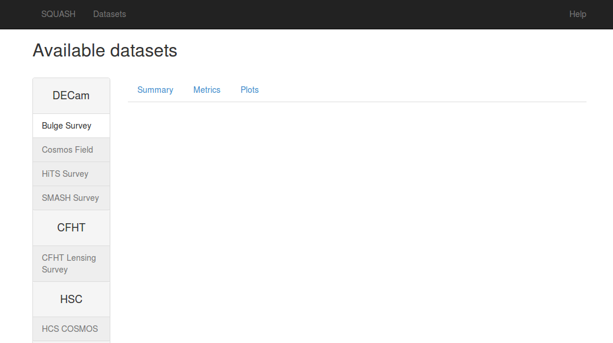

..
  Content of technical report.

  See http://docs.lsst.codes/en/latest/development/docs/rst_styleguide.html
  for a guide to reStructuredText writing.

  Do not put the title, authors or other metadata in this document;
  those are automatically added.

  Use the following syntax for sections:

  Sections
  ========

  and

  Subsections
  -----------

  and

  Subsubsections
  ^^^^^^^^^^^^^^

  To add images, add the image file (png, svg or jpeg preferred) to the
  _static/ directory. The reST syntax for adding the image is

  .. figure:: /_static/filename.ext
     :name: fig-label
     :target: http://target.link/url

     Caption text.

   Run: ``make html`` and ``open _build/html/index.html`` to preview your work.
   See the README at https://github.com/lsst-sqre/lsst-report-bootstrap or
   this repo's README for more info.

   Feel free to delete this instructional comment.

:tocdepth: 1

Draft in development, to be used by developers in the QA sprint during the extend cycle.

Introduction
============

This document describes the implementation of a prototype dashboard for the
Science Quality Analysis Harness (SQUASH) system.

As stated in http://sqr-008.lsst.io the verification datasets use case 
gives us the oportunity to leverage
QA tests done in the past with pipeQA and more recently with HSC and CFHT QA 
scripts in a comprehensive environment to preserve the codes and practices developed
by the verification datasets group.

The development will follow the rapid prototype workflow to reach this goal more
efficiently. In this process we build the initial interfaces, discuss its 
layout and content, and as soon as we have a minimal viable product we ship 
the code for use and test purposes. In this process, we will take users 
feedback and iterate back to face usability and performance issues trying 
to engage them in the development. The ultimate goal
is to anticipate SQUASH needs for commissioning and to provide feedback to
the production system design based on the experience in analyzing precursor 
datasets.

Selecting the right technology stack
====================================

The selected technologies prioritize the use of Python as the 
main development language for rapid prototyping, and the use of the 
selected framework features as much as possible. The main visualization needs,
as summarized at https://dev.lsstcorp.org/trac/wiki/Winter2014/Design/DataAnalysisToolkit
were also taken into consideration.

TODO: Summarize visualization requirements here.

The web application is being developed in Django  and we expect less work
on this part of the project as the project structure and initial dashboard application
is done. The QA database is modeled using the object-relational mapper 
(ORM) built in the Django framework.

As for the web application, the Bootstrap framework for web styling is very popular, it supports
responsive pages on all sorts of devices and can easily be used in combination 
with Django.

Once the basic project is done, we expect that the main development to
happen in the bokeh plotting library and datashader to
create interactive visualization and in the QA database model to extend this prototype.

For FITS image visualization we plan to use FFTools JS API to open individual
ccd images linked from the dashboard.

Still, for sky visualization we plan to integrate Aladin Lite JS plugin. In Aladin, the processed
dataset images must be pre-rendered in HiPS format
(http://aladin.u-strasbg.fr/hips/) 
which demands some processing but we benefit from a number of reference survey 
images already available as well as the source catalog and polygon overlay features to display CCDs, visits etc.

The QA analysis code (see for instance http://dmtn-008.lsst.io/en/latest/) are *afterburner* scripts that run on the
output of the LSST stack processing. The implementation of the QA workflow and parallelization will be discussed in
a separate document.

Components
==========

The main components of the SQUASH dashboard prototype are shown in figure 1. 
The figure shows the integration of the QA analysis code with the Django
web application, the Bokeh-server and the QA Database through the ORM layer. 

.. figure:: _static/components.png
   :name: fig-components
   :target: _static/components.png
   :alt: Main components of the SQUASH prototype 

   Main components of SQUASH dashboard prototype.

For development all these components run on a local computer, but if
development requires larger data volumes we can imagine
a situation were the QA database, and perhaps the bokeh server run on a remote 
node.

Implementation Phases
=====================

Phase 1: DM-5728 Create Django project and initial dashboard app  (See Appendix A)

    - Implement the ``Dataset``, ``Visit`` and ``Ccd`` tables in the django ORM layer, as a minimum set
    of tables for the dashboard app
    - Prototype home page and dashboard pages
    - Integration of bokeh server with Django

Phase 2: DM-5745 Implement ingestion code for the QA results

    - Ability to ingest JSON file produced by QA analysis code described in dmtn-008.lsst.io/en/latest/

Phase 2: Adding more interactions to the dashboard
    - Ability to display available datasets
    - Ability to select a dataset and display QA results for each visit in a table
    - Ability to select a visit from a list or from a plot
      and display the focal plane with summary information for each ccd 
      (color coded)
    - Ability to navigate through the list of visits
    - Ability to display QA plots at the visit level
    - Ability to select a ccd and display QA plots at the ccd level
    - Model metrics tables in the Django ORM layer
    - Ability to display metrics at ccd and visit levels

Phase 3: Adding support to multiple runs
    - Model processing tables in the Django ORM layer
    - Ability to display and select available runs for each dataset
    - Ability to access process information

Clonning the project
====================

Project structure
-----------------

.. code-block:: text

    .
    ├── dashboard
    │   ├── admin.py
    │   ├── __init__.py
    │   ├── migrations
    │   │   ├── 0001_initial.py
    │   │   ├── __init__.py
    │   ├── models.py
    │   ├── tests.py
    │   └── views.py
    ├── db.sqlite3
    ├── manage.py
    └── squash
        ├── __init__.py
        ├── settings.py
        ├── urls.py
        └── wsgi.py

Extending the prototype
=======================

Adding a new plot to the dashboard
----------------------------------

Adding new ccd property at and display 
--------------------------------------

   - Edit the models.py and the new property in the Ccd class
   - Use Django to generate a new migration 
   - Change the QA script to register the new property
   - Add the new property in the views.py
   - Display the new property in a table or plot

Adding a new tab in the Datasets page
-------------------------------------

Adding a new page to the webapp
-------------------------------

References
==========

 - Rapid Prototyping
 - Bokeh webminar
 - Dashboard webminar
 - HiPS: http://aladin.u-strasbg.fr/hips/
 - Django Database API Reference https://docs.djangoproject.com/en/1.9/topics/db/queries/
 - Model Field Types https://docs.djangoproject.com/en/1.9/ref/models/fields/#model-field-types
 - Use MySQL or MariaDB with your Django Application https://www.digitalocean.com/community/tutorials/how-to-use-mysql-or-mariadb-with-your-django-application-on-ubuntu-14-04

APPENDIX A - Making of the squash project
=========================================

In this appendix we document the initial steps used to create
the Django project and the integration with the bokeh-server. 

Python Package Requirements 
---------------------------

TODO: move this to requirements.txt in the repository

We want to use a few more Python packages than the ones mentioned above:

    - Python 3.4.4
    - Django 1.8.4
    - Bootstrap 3.3.6
    - WebTest 2.0.16
    - django-webtest 1.7.7
    - Bokeh 0.11
    - Datashader 0.1

TODO: try to install everything with pip instead of conda, create a virtualenv.

Creating the project
--------------------

.. code-block:: text

    $ django-admin.py startproject squash
    $ cd squash

Running this command creates a new directory called squash, there is a manage.py file which is used to manage a number of aspects of the Django application such as creating the database and running the development web server.  Two other files are squash/settings.py which contains configuration information for the application such as how to connect to the database and squash/urls.py which maps URLs called by the browser to the appropriate Python code.

Setting up the database
-----------------------

.. code-block:: text

    $ python manage.py migrate
    $ python manage.py createsuperuser

After running this command, there will be a database file db.sqlite3 in the same directory as manage.py. SQLite works
great for development, in production we will probably use MySQL. This command looks at ``INSTALLED_APPS`` in
``squash/settings.py`` and creates database tables for those apps.

Creating the dashboard app
--------------------------

Every app in Django has its own model, lets create the dashboard app.

.. code-block:: text

    $ python manage.py startapp dashboard

and let Django knows it exists by adding the new app at ``INSTALLED_APPS`` in ``squash/settings.py``

.. code-block:: python

    # Application definition

    INSTALLED_APPS = (
        'django.contrib.admin',
        'django.contrib.auth',
        'django.contrib.contenttypes',
        'django.contrib.sessions',
        'django.contrib.messages',
        'django.contrib.staticfiles',
        'dashboard',
    )

Let's create the Datasets, Visit and Ccds tables (as outlined
in Phase 1) by writing the corresponding classes in the ``dashboard/models.py`` file.

.. code-block:: text

    $ python manage.py makemigrations
    Migrations for 'dashboard':
        0001_initial.py:
            - Create model Ccd
            - Create model Dataset
            - Create model Visit
            - Add field visitId to ccd

.. code-block:: text

    $ python manage.py migrate
    Operations to perform:
      Synchronize unmigrated apps: staticfiles, messages
      Apply all migrations: sessions, admin, auth, contenttypes, dashboard
    Synchronizing apps without migrations:
      Creating tables...
        Running deferred SQL...
      Installing custom SQL...
    Running migrations:
      Rendering model states... DONE
      Applying dashboard.0001_initial... OK

Migrations are Django’s way of managing changes to models and the corresponding database tables. In order to see these
tables from the Django admin interface by registering the new models here ``dashboard/admin.py``:

.. code-block:: python

    from django.contrib import admin
    from .models import Dataset, Visit, Ccd
    
    admin.site.register(Dataset)
    admin.site.register(Visit)
    admin.site.register(Ccd)

Start up the development server and navigate to the admin site http://localhost:8000/admin/ to see the new tables:

.. code-block:: text

    $ python manage.py runserver

Prototype layouts
-----------------

Basic Styling
^^^^^^^^^^^^^

Download Bootstrap from http://getbootstrap.com/getting-started/#download
and extract it the ``static`` directory, it provides the basic styling for the website.

The ``static`` directory must be defined in the ``squash/settings.py`` file:

.. code-block:: text

    STATICFILES_DIRS = (
        os.path.join(BASE_DIR, 'static'),
        )

Home and Dashboard page layouts
^^^^^^^^^^^^^^^^^^^^^^^^^^^^^^^

When creating a website it is useful to prototype the 
layout of the pages first. This section explains a mechanism implemented
in squash to do that.

The ``layouts`` directory contains the prototype layouts, it is referenced
using a settings variable in ``squash/settings.py``:

.. code-block:: text

    SITE_PAGES_DIRECTORY=os.path.join(BASE_DIR, 'layouts')
    ...

The URL structure implemented in squash/urls.py matches the files in the ``layouts``
directory and loads their content using the ``template/page.html``.

With that it's easy to add new prototpype layout pages and have dynamic links to them.

For example, in pages/index.html the code

.. code-block:: text

     href=""

looks for the  pages/dashboard.html file. See below example of prototype pages.

.. figure:: _static/home.png
   :name: fig-components
   :target: _static/home.png
   :alt: Prototype layout for SQUASH home
    
   Prototype layout for SQUASH home 

    
   Prototype layouts for SQUASH

