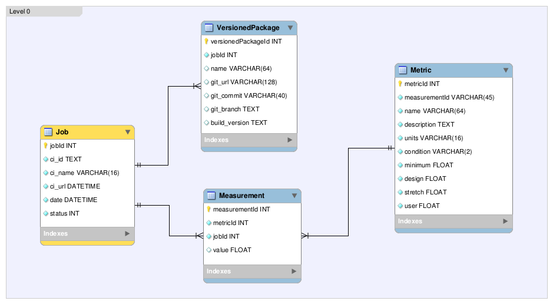

..
  Content of technical report.

  See http://docs.lsst.codes/en/latest/development/docs/rst_styleguide.html
  for a guide to reStructuredText writing.

  Do not put the title, authors or other metadata in this document;
  those are automatically added.

  Use the following syntax for sections:

  Sections
  ========

  and

  Subsections
  -----------

  and

  Subsubsections
  ^^^^^^^^^^^^^^

  To add images, add the image file (png, svg or jpeg preferred) to the
  _static/ directory. The reST syntax for adding the image is

  .. figure:: /_static/filename.ext
     :name: fig-label
     :target: http://target.link/url

     Caption text.

   Run: ``make html`` and ``open _build/html/index.html`` to preview your work.
   See the README at https://github.com/lsst-sqre/lsst-report-bootstrap or
   this repo's README for more info.

   Feel free to delete this instructional comment.

:tocdepth: 1

Draft in development, to be used by developers in the QA sprint during the extend cycle.

Introduction
============

This document describes the implementation of a prototype dashboard for the
Science Quality Analysis Harness (SQUASH) system.

As stated in http://sqr-008.lsst.io the verification datasets use case
gives us the oportunity to leverage QA tests done in the past with pipeQA and more recently with HSC and CFHT QA
scripts in a comprehensive infrastructure to preserve the codes and practices developed
by the verification datasets group.

For level 0 QA, the prototype will test the stability of the single visit processing and QA codes in the LSST
stack by measuring key performance metrics using a fixed dataset and configuration.

The development will follow the rapid prototype workflow to reach this goal more
efficiently. As soon as we have a minimal viable product we'll ship it to production.
In this process, we want early feedback from users and iterate back on usability issues.

The ultimate goal is to anticipate SQUASH needs for commissioning and to provide feedback to
the production QA systems based on the experience of testing precursor
datasets.

Selecting the right technology stack
====================================

The selected technologies prioritize the use of Python as the 
main development language, and the use of the selected framework features as much as possible.

The web application is being developed in Django  and we expect less work
on this part of the project as the project structure and initial dashboard application
is done.

The QA database is modeled using the object-relational mapper
(ORM) built in the Django framework.

The dashboard will use the bokeh plotting library and datashader to
create interactive visualizations.

For level 0 QA, the metrics code (see for instance http://dmtn-008.lsst.io/en/latest/) is an *afterburner* scripts that
runs on the output of the LSST stack processing. These scripts will be executed as **Jenkins** job as part of continuous
integration runs.

For level 1 and 2 QA, FITS image visualization will be added using FFTools JS API linked from the dashboard.
For sky visualization we plan to integrate Aladin Lite JS plugin. In Aladin, images must be pre-generated in
HiPS format (http://aladin.u-strasbg.fr/hips/)

The main visualization needs, as summarized at https://dev.lsstcorp.org/trac/wiki/Winter2014/Design/DataAnalysisToolkit
has also been taken into consideration.

Architecture
============

The architecture of the SQUASH dashboard is shown in figure 1.
The QA analysis code sends data to the dashboard through a ``POST`` request
and a ``post_save`` signal from Django is used to update the bokeh sessions.

.. figure:: _static/components.png
   :name: fig-components
   :target: _static/components.png
   :alt: Main components of the SQUASH prototype 

   Main components of SQUASH dashboard prototype.

Implementation Phases
=====================

Phase 1: Initial Django project and integration with bokeh server
^^^^^^^^^^^^^^^^^^^^^^^^^^^^^^^^^^^^^^^^^^^^^^^^^^^^^^^^^^^^^^^^^

    - DM-5728 Create Django project and initial dashboard app  (See Appendix A)
        - Implement the ``Job``, ``Metric`` and ``Measurement`` tables in the django ORM layer, as a minimum set of tables for the dashboard app
        - Prototype home page and dashboard pages
    - DM-5750 Integration of Django with bokeh server

Phase 2: Integration with QA analysis code
^^^^^^^^^^^^^^^^^^^^^^^^^^^^^^^^^^^^^^^^^^

    - DM-5745 implement ingestion code for the QA results
        - Ability to ingest JSON outputs produced by QA analysis code described in http://dmtn-008.lsst.io/en/latest/

Phase 3: Adding interactions to the dashboard
^^^^^^^^^^^^^^^^^^^^^^^^^^^^^^^^^^^^^^^^^^^^^

    - Ability to select a job and display QA results
    - Ability to display job information (Jenkins API?)
    - Ability to navigate through the list of Metrics

Phase 4: Adding support to multiple datasets
^^^^^^^^^^^^^^^^^^^^^^^^^^^^^^^^^^^^^^^^^^^^

    - Add datasets table in the Django ORM layer
    - Ability to access dataset information
    - Ability to display and select available runs for each dataset

Phase 5: Integration with Aladin
^^^^^^^^^^^^^^^^^^^^^^^^^^^^^^^^

Cloning the project
====================

.. code-block:: text

    $ git clone  https://github.com/lsst-sqre/qa-dashboard.git

Create a virtualenv, install dependencies and work on a specific feature
^^^^^^^^^^^^^^^^^^^^^^^^^^^^^^^^^^^^^^^^^^^^^^^^^^^^^^^^^^^^^^^^^^^^^^^^
.. code-block:: text

    $ cd qa-dashboard
    $ virtualenv env -p python3
    $ source env/bin/activate
    $ pip install -r requirements.txt
    $ python -c "import django; print(django.get_version())"
    1.8.4
    $ git branch  # See implementation phases above and pick the feature to work on
    $ git checkout ticket-NNNN

Level 0 QA
==========

For level 0 QA, the data model includes the ``Job``, ``Measurement`` and ``Metric`` tables which are sufficient to
characterize a metric, its measurement and information about the job that performed the measurement.

   Level 0 database schema.

The metrics table is initialized with the values specified in the science requirements document LPM-17, example:

.. figure:: _static/api-metric.png
   :name: api-metric
   :target: _static/api-metric.png
   :alt: API endpoint for listing and creating metrics

   API endpoint for listing and creating metrics.

.. code-block:: python

   >>> import requests
   >>> response = requests.get('http://localhost:8000/api/')
   >>> response.status_code
   200
   >>> api = response.json()
   >>> api['metric']
   'http://localhost:8000/api/metric/'
   >>>
   >>> metric = {
                  'metric': 'PA1',
                  'description': 'Photometric Repeatability',
                  'units': 'millimag',
                  'minimum': '8',
                  'design': '5',
                  'stretch': '3',
                  'user': '10',
                  }
   >>> response = requests.post(api['metric'], data=metric, auth=(TEST_USER, TEST_PASSWD))
   >>> response.status_code
   201

A job and the result of its measurement can be inserted in a single request given the metric name, example:

.. code-block:: python

   >>> job = {
            "name": "ci_cfht",
            "build": "1",
            "runtime": "2016-04-24T19:26:12.561564Z",
            "url": "https://ci.lsst.codes/job/ci_cfht/1/",
            "status": 0,
            "measurements": [{ "metric": "PA1", "value": 5.0}]
         }

   >>> response = requests.post(api['job'], data=job, auth=(TEST_USER, TEST_PASSWD))
   >>> response.status_code
   201

Extending the prototype
=======================

Changing the data model
^^^^^^^^^^^^^^^^^^^^^^^

   - Edit the models.py and the new property in the model
   - Use Django to generate a new migration
   - Change the ingestion script to register the new property
   - Add the new property in the views.py
   - Display the new property in a table or plot

Adding a new tab in the dashboard
^^^^^^^^^^^^^^^^^^^^^^^^^^^^^^^^^

TODO

Adding a new plot to the dashboard
^^^^^^^^^^^^^^^^^^^^^^^^^^^^^^^^^^

TODO

References
==========

 - Rapid Prototyping
 - Bokeh webminar
 - Dashboard webminar
 - HiPS: http://aladin.u-strasbg.fr/hips/
 - Django Database API Reference https://docs.djangoproject.com/en/1.9/topics/db/queries/
 - Model Field Types https://docs.djangoproject.com/en/1.9/ref/models/fields/#model-field-types
 - Use MySQL or MariaDB with your Django Application https://www.digitalocean.com/community/tutorials/how-to-use-mysql-or-mariadb-with-your-django-application-on-ubuntu-14-04

APPENDIX A - Making of the SQUASH  project
==========================================

In this appendix we document the initial setup to create
the Django project (tickets/DM-5728) and its integration with the bokeh server (tickets/DM-5750).

Creating the django project
^^^^^^^^^^^^^^^^^^^^^^^^^^^

.. code-block:: text

    $ django-admin.py startproject squash

Running this command creates a new directory called squash, there is a ``manage.py`` file which is used to manage a
number of aspects of the Django application such as creating the database and running the development web server.
Two other important files are ``squash/settings.py`` which contains configuration information for the application
such as how to connect to the database and ``squash/urls.py`` which maps URLs called by the browser
to the appropriate Python code.

Setting up the database
^^^^^^^^^^^^^^^^^^^^^^^

.. code-block:: text

    $ cd squash
    $ python manage.py migrate
    $ python manage.py createsuperuser

After running this command, there will be a database file ``db.sqlite3`` in the same directory as ``manage.py``. SQLite works
great for development, in production we will probably use MySQL. This command looks at ``INSTALLED_APPS`` in
``squash/settings.py`` and creates database tables for them. There are a number apps e.g ``admin``, ``auth`` and ``sessions``
installed by default.

Creating the dashboard app
^^^^^^^^^^^^^^^^^^^^^^^^^^

Lets create the dashboard app, every app in Django has its own model

.. code-block:: text

    $ python manage.py startapp dashboard

let Django knows about its existence by adding the new app at ``INSTALLED_APPS`` in ``squash/settings.py``

.. code-block:: python

    # Application definition

    INSTALLED_APPS = (
        'django.contrib.admin',
        'django.contrib.auth',
        'django.contrib.contenttypes',
        'django.contrib.sessions',
        'django.contrib.messages',
        'django.contrib.staticfiles',
        'dashboard',
    )

Let's create the models for ``Datasets``, ``Visit`` and ``Ccds`` by writing the corresponding classes in the
``dashboard/models.py`` file, that is a minimum set of tables needed to make the dashboard useful.

.. code-block:: text

    $ python manage.py makemigrations
    Migrations for 'dashboard':
        0001_initial.py:
            - Create model Ccd
            - Create model Dataset
            - Create model Visit
            - Add field visitId to ccd

.. code-block:: text

    $ python manage.py migrate
    Operations to perform:
      Synchronize unmigrated apps: staticfiles, messages
      Apply all migrations: sessions, admin, auth, contenttypes, dashboard
    Synchronizing apps without migrations:
      Creating tables...
        Running deferred SQL...
      Installing custom SQL...
    Running migrations:
      Rendering model states... DONE
      Applying dashboard.0001_initial... OK

Migrations are Django’s way of managing changes to models and the corresponding database tables. You have to register
the new models here ``dashboard/admin.py`` in order to see the tables from the Django admin interface.

.. code-block:: python

    from django.contrib import admin
    from .models import Dataset, Visit, Ccd
    
    admin.site.register(Dataset)
    admin.site.register(Visit)
    admin.site.register(Ccd)

Start up the development server and navigate to the admin site http://localhost:8000/admin/ to see the new tables:

.. code-block:: text

    $ python manage.py runserver

Prototype layouts
^^^^^^^^^^^^^^^^^

Basic Styling
-------------

Download Bootstrap from http://getbootstrap.com/getting-started/#download
and extract it the ``static`` directory, it provides the basic styling for the website.

The ``static`` directory must be defined in the ``squash/settings.py`` file:

.. code-block:: text

    STATICFILES_DIRS = (
        os.path.join(BASE_DIR, 'static'),
        )

Integration with bokeh server
^^^^^^^^^^^^^^^^^^^^^^^^^^^^^

TODO

