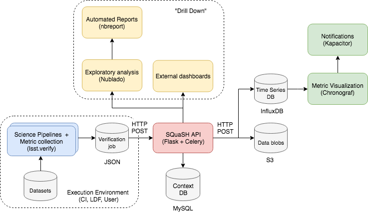

..
  Content of technical report.

  See http://docs.lsst.codes/en/latest/development/docs/rst_styleguide.html
  for a guide to reStructuredText writing.

  Do not put the title, authors or other metadata in this document;
  those are automatically added.

  Use the following syntax for sections:

  Sections
  ========

  and

  Subsections
  -----------

  and

  Subsubsections
  ^^^^^^^^^^^^^^

  To add images, add the image file (png, svg or jpeg preferred) to the
  _static/ directory. The reST syntax for adding the image is

  .. figure:: /_static/filename.ext
     :name: fig-label
     :target: http://target.link/url

     Caption text.

   Run: ``make html`` and ``open _build/html/index.html`` to preview your work.
   See the README at https://github.com/lsst-sqre/lsst-report-bootstrap or
   this repo's README for more info.

   Feel free to delete this instructional comment.

:tocdepth: 1

.. note::
    Work in progress.

Introduction
============

We present the current design for the Science Quality Analysis Harness (SQuaSH) metrics dashboard being developed by LSST/DM SQuaRE as part of the verification effort.

The verification of the LSST software stack performance on simulated and precursor data sets is an important activity during the project construction phase. It gives LSST/DM the opportunity to develop Quality Control (QC) infrastructure and Quality Analysis (QA) code to support the development of the stack and evaluate its results.

The DM Science Data Quality Assurance (SDQA) System Conceptual Design (see `LDM-522 <http://ls.st/LDM-522>`_) describes the  QC services and QA activities necessary to implement the capabilities listed in the LSST Data Quality Assurrance plan `LDM-63 <http://ls.st/LSE-63>`_. In particular, it describes the different tasks to be performed in each QC tier, starting from the **QC Tier 0** which aims to test and verify the DM sub-system during software development, to the **QC Tier 3** which will enable the science collaboration to evaluate the data quality for their own science analyses.

SQuaSH is a QC service, in its current implementation it is focused on **QC Tier 0** tasks. For that we compute  Key Performance Metrics (KPMs) on *fixed* data sets to monitor the stability of the LSST software stack through the Jenkins Continuous Integration (CI) system from daily builds. As part of the CI pipeline, the KPMs are computed by afterburner packages such as ``validate_drp`` (see  `DMTN-008 <http://dmtn-008.lsst.io/en/latest/>`_) implemented using the `LSST Verification Framework <https://sqr-019.lsst.io>`_ and the results are sent to the SQuaSH metrics dashboard for monitoring.

In addition to the CI environment we propose a workflow for developers enabling them to run verification packages locally to perform their metric measurements and visualize the results using SQuaSH. We discuss the SQuaSH integration with the LSST Science Platform (LSP) and how users of the notebook aspect of the LSP can benefit from pre-built SQuaSH apps embeded in the Jupyter notebooks. Finally, in the Appendix we provide more information about the system architecture and its deployment on the Google Kubernetes Engine (GKE).

The current production version of the SQuaSH metrics dashboard can be found at https://squash.lsst.codes/ and the current development version is available at https://squash-demo.lsst.codes/.

We expect to get feedback from users and iterate with the science pipelines group to incorporate their metrics and visualizations in SQuaSH. The main goal is to anticipate the needs for commissioning and to leverage the production SDQA system based on this experience.

Design guidelines
=================

Some of the design guidelines and characteristics of SQuaSH are summarized below:

 - implement the concepts developed in the `LSST Verification Framework <https://sqr-019.lsst.io>`_
 - implement a QC database to support the tasks performed in the QC Tier 0, 1, 2 and 3 to preserve and visualize their results
 - support multiple test datasets and multiple verification packages
 - support automated verification runs, initially through the Jenkins CI environment and other execution environments
 - support verification package runs from the developer "local" environment
 - enable interactive visualization for the metric measurements
 - correlate deviations of the metric measurements with code changes
 - provide notifications/alerts upon metric measurement deviations
 - provide the so called "drill down" capability, i.e, in addition to the visualization of the scalar metrics enable further interactive visualization from the same  data used to perform the metric measurements
 - extensible: make it easy for contributors to add new visualizations (a.k.a SQuaSH apps)
 - embeddable: reuse SQuaSH apps for analysis in the LSP notebook aspect
 - replaceable: easy to replace SQuaSH components keeping up with standard technologies
 - deployable on Kubernetes

Other desired characteristics:

 - multi user environment is to keep results from user "local" verification runs
 - the SQuaSH API should support execution of jobs on Kubernetes for QC-Tier 2 and 3
 - automated execution of the verification packages and arbitrary analysis code (probably in the form of notebooks) on a exposure by exposure basis, e.g. end-of-night report

Commissioning Extensions for SQuaSH
-----------------------------------
   * https://confluence.lsstcorp.org/display/LSSTCOM/Commissioning+Extensions+for+SQuaSH

SQuaSH in the context of the DM software development
====================================================

In its `current implementation <https://squash.lsst.codes/>`_, SQuaSH supports verification packages that run through the Jenkins CI environment and stores the corresponding metric measurements and data used to compute them as data blobs (metadata plus tabular data). The test data sets are stored on `Git LFS <https://sqr-001.lsst.io/>`_ repositories, the Jenkins CI execution environment performs data reduction and verification package runs, the ``Job`` object produced by the verification package is serialized and persisted as a JSON document, as defined by the verification framework, and sent to the SQuaSH RESTful API so that the results can be visualized through `Bokeh apps <https://bokeh.pydata.org/en/latest/>`_ served by SQuaSH.

Support for multiple execution environments
-------------------------------------------

In order to be useful for the verification activities SQuaSH must support multiple execution enviroments like the Jenkins CI, the user "local" environment, the verification cluster environment and potentially others.

In the verification framework, a ``Job`` packages several measurements, metadata and data blobs. The metadata contains information about the execution environment.

Examples of verification ``Job`` metadata for different execution environments:

   * Jenkins CI
      * Look up key: ID of the CI run
      * Environment metadata: ``ci_name``, ``ci_dataset``, ``ci_label``, ``ci_url``, lsstsw and extra packages
   * User local environment (imply support to multiple users)
      * Look up key: ID of the user run
      * Environment metadata: lsstsw and extra packages
   * Verification Cluster
      * Look up key: ID of the verification cluster run.
      * Environment metadata: lsst stack build (assuming we are using stable versions of the stack only)

.. note::
    For **QC Tier 1** the metadata may include things like the stack configuration used in each run.

The SQuaSH RESTful API provides a generic resource to interact with jobs and specific resources to interact with runs on different execution environments that ultimately map to a job. In this way a request to ``/jenkins/<ci_id>`` or ``/local/<username>/<run_id>`` will look up for the corresponding ``/jobs/<job_id>`` to retrieve the associated measurements, metadata and data blobs.

Possible workflow for DM developers (the jointcal use case)
-----------------------------------------------------------

SQuaSH in the context of the LSST Science Platform
==================================================

.. figure:: _static/squash_lsp.png
   :name: overview
   :target: _static/overview.png
   :alt: SQuaSH in the context of the LSP

Using the LSP environment for QC-Tier 3 analysis. Using SQuaSH to submit verification runs in the verification cluster. Embedding SQuaSH apps in the JupyterLab environment.

Appendix
========

Deployment
----------

SQuaSH is currently deployed to a commodity cloud, the Google Cloud Platform, on the Google Kubernetes Engine (GKE), and is architected as independent microservices. The figure below shows the various "layers" of the Kubernetes deployment, the *service* which provides an external IP to the microservice, the *pod* which groups containers running on the same GKE node. Other Kubernetes objects like *secrets* and customized configurations stored as *configmaps* are also indicated in the figure. The microservices ``squash-restful-api``, ``squash-bokeh`` and ``squash-dash`` are connected through HTTPS and TLS termination is implemented trough the ``nginx`` container which works as a reverse proxy to secure the traffic outside the pods.

.. figure:: _static/squash-deployment.png
   :name: squash-deployment
   :target: _static/squash-deployment.png
   :alt: SQuaSH Kubernetes deployment

The general instructions to deploy squash can be found at `squash-deployment <https://github.com/lsst-sqre/squash-deployment>`_ with links to the individual microservices:

   * `squash-restful-api <https://github.com/lsst-sqre/squash-rest-api>`_: it is used to manage the SQuaSH metrics dashboard. The SQuaSH RESTful API was developed initially using `Django DRF <https://github.com.lsst-sqre/squash-api>`_ and then reimplemented in Flask with several extensions. It also uses Celery to enable the execution of tasks in background. This can be extended later to

   * `squash-bokeh <https://github.com/lsst-sqre/squash-bokeh>`_: it serves the squash bokeh apps, we use the `Bokeh plotting library <http://bokeh.pydata.org/en/latest>`_ for rich interactive visualizations.

   * `squash-dash <https://github.com/lsst-sqre/squash-dash>`_: dashboard to embed the bokeh apps. Alternatively we are exploring the possibility to embed the same apps in the Jupyter Lab environment of the LSST Science Platform.

The QC Tier 0 database
----------------------

For the QC Tier 0 DB, we opted for a relational database. The motivation behind this choice is that we plan to deploy QC DBs to the Oracle *consolidated database* as part of the LSP. SQuaSH currently uses an instance of MySQL 5.7 deployed to Cloud SQL. We chose MySQL over MariaDB, used in Qserv, because of the support to JSON data types which are used in this implementation to make the database schema more generic. We store Job metadata, environment metadata as well as metric definitions and specifications as JSON blobs.

Current SQuaSH database schema for QC Tier 0 tasks. This implementation supports multiple verification packages and multiple execution environments.

   * Entities:
      * ``env``, ``user``, ``job``, ``package``, ``blob``, ``measurement``, ``metric``, ``spec``
   * Relationships:
      * ``1 env : N jobs``
      * ``1 job : N packages``
      * ``1 job : N measurements``
      * ``M measurements : N data blobs``
      * ``1 metric : N specs``
      * ``1 metric : N measurements``

.. figure:: _static/qc-0-db.png
   :name: QC Tier 0 Database
   :target: _static/qc-0-db.png
   :alt: QC Tier 0 Database

Back ups of the SQuaSH QC Tier 0 DB are automated in Cloud SQL.

The SQuaSH RESTful API
----------------------

The SQuaSH RESTful API is a web app implemented in Flask for managing the SQuaSH metrics dashboard.

Current version
^^^^^^^^^^^^^^^

By default, all requests to https://squash-restful-api-demo.lsst.codes/ receive version 1.0 (default) of the RESTful API. The default version of the API may change in the future, thus we encourage you to explicitly request versions via the Accept header.

You can specify a version like this:

.. code-block:: json

    Accept: application/json; version=1.0

Schema
^^^^^^

All API access is over HTTPS, accessed from the https://squash-restful-api-demo.lsst.codes/. All data is sent and received
as JSON.

Authentication
^^^^^^^^^^^^^^

Operations like POST and DELETE (see below) require authentication. To authenticate through the SQuaSH RESTful API you need to provide a valid access token in the authorization header, which can be obtained from the `/auth` endpoint for a registered user:

.. code-block:: python

    import requests

    # assuming a registered user
    user = {'username': user, 'password': passwd}
    r = requests.post("https://squash-restful-api-demo.lsst.codes/auth", json=user)
    access_token = 'JWT ' + r.json()['access_token']

    # assuming you a have a job document you want to post to SQuaSH
    headers = {'Authorization': access_token}
    r = requests.post("https://squash-restful-api-demo.lsst.codes/job", json=job, headers=headers)

Documentation
^^^^^^^^^^^^^

The SQuaSH RESTful API follows the `OpenAPI 2.0 documentation specification <https://github.com/OAI/OpenAPI-Specification/blob/master/versions/2.0.md>`_. The specification is extracted from the docstrings by the `flasgger <https://github.com/rochacbruno/flasgger>`_ utility which is also used to create the `Swagger UI <https://squash-restful-api-demo.lsst.codes/apidocs>`_ for the API.

.. note::
    The Swagger UI is experimental, authentication does not work through this interface yet.

This `notebook <https://github.com/lsst-sqre/squash-rest-api/blob/master/tests/test_api.ipynb>`_ provides an example on how
to interact with the SQuaSH RESTful API from registering a new user in SQuaSH to loading a verification job.

All the available resources and possible operations are listed below:

.. openapi:: _static/apispec_1.json

